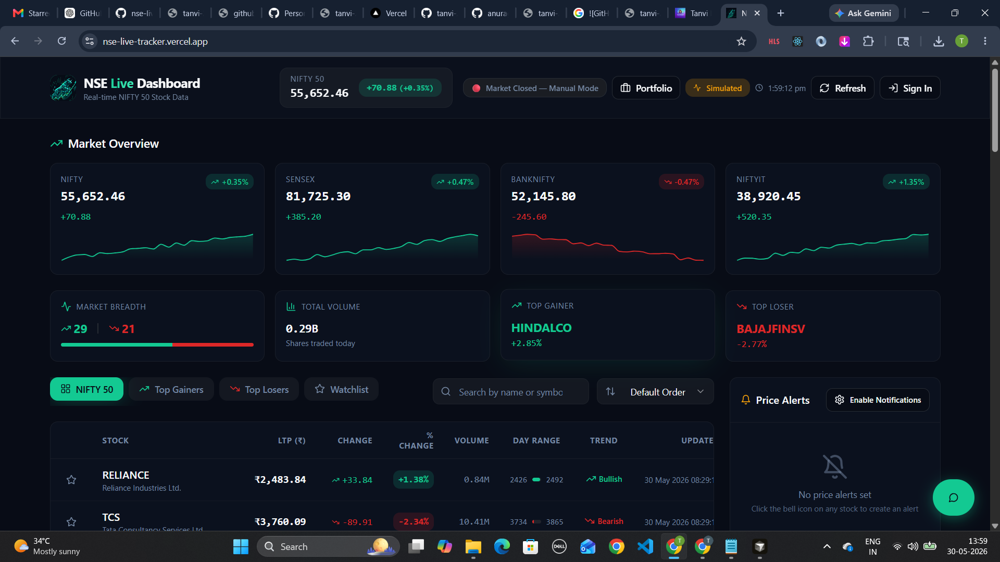
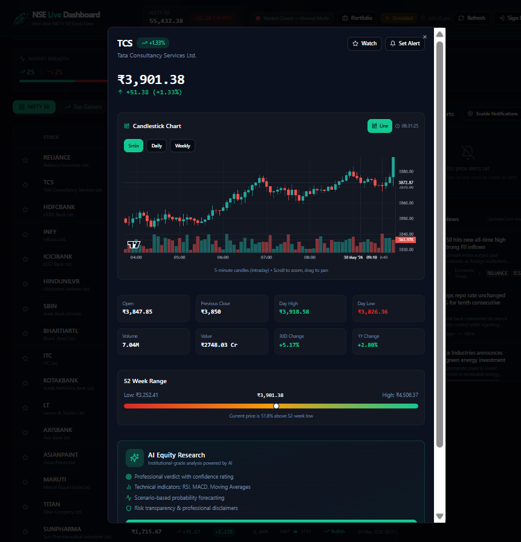
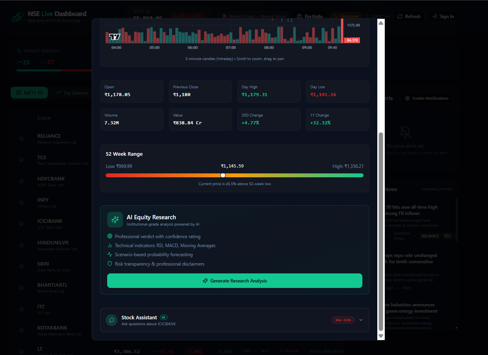
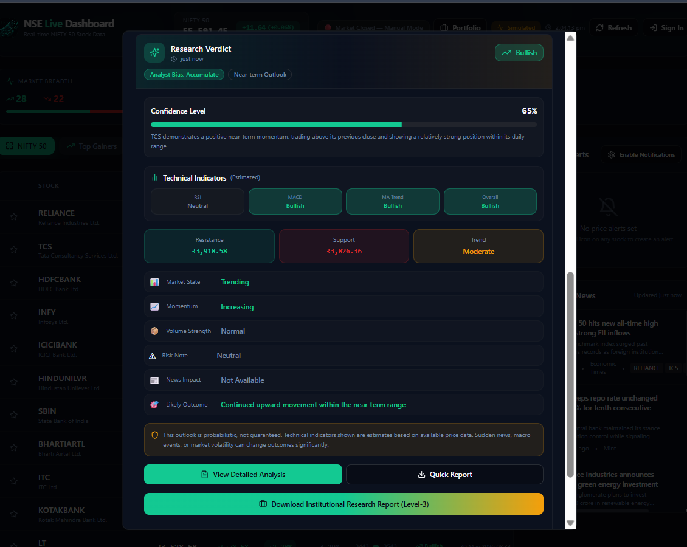

# 📈 NSE Live Tracker

Enterprise-grade stock market intelligence platform for Indian equities featuring real-time market monitoring, AI-powered research, portfolio management, technical analysis, watchlists, alerts, and institutional-style reporting.

🔗 **Live Demo:** https://nse-live-tracker.vercel.app

---

# 🚀 Overview

NSE Live Tracker is a modern stock market analytics platform built for tracking and analyzing Indian equity markets in real time.

The platform provides live market insights, AI-generated stock research, portfolio management, watchlists, technical indicators, alerts, and institutional-style analysis dashboards through a responsive and production-grade user interface.

Designed with scalability and performance in mind, the application combines real-time market visualization with AI-powered decision support systems.

---

# ✨ Features

## 📊 Real-Time Market Dashboard

- Live NIFTY 50 market monitoring
- Market breadth visualization
- Top gainers and losers tracking
- Live stock performance metrics
- Volume and trend monitoring
- Interactive market overview

---

## 📈 Stock Analytics

- Intraday stock movement tracking
- Day high and low analysis
- Volume analysis
- Historical performance metrics
- 52-week range visualization
- Technical trend indicators

---

## 🤖 AI-Powered Equity Research

- AI-generated stock analysis
- Confidence-based research verdicts
- Technical indicator interpretation
- RSI analysis
- MACD analysis
- Moving average analysis
- Support and resistance detection
- Market sentiment evaluation

---

## 💼 Portfolio Management

- Portfolio tracking
- Asset monitoring
- Performance insights
- Profit and loss calculations
- Holdings management

---

## ⭐ Watchlists

- Custom stock watchlists
- Favorite stock tracking
- Quick stock access
- Personalized monitoring

---

## 🔔 Smart Alerts

- Price alert creation
- Notification management
- Custom trigger conditions
- Market event tracking

---

## 💬 AI Stock Assistant

- Context-aware stock assistant
- Market-related Q&A
- Stock-specific insights
- AI-powered guidance

---

## 📄 Research Reports

- Institutional-style reports
- Downloadable analysis reports
- Technical research summaries
- Market intelligence insights

---

## 🔐 Authentication & User Management

- Secure authentication
- User-specific portfolios
- Personalized watchlists
- Protected routes
- Session management

---

# 🛠️ Tech Stack

## Frontend

- React.js
- TypeScript
- Tailwind CSS
- Recharts
- React Router

## Backend

- Supabase
- Edge Functions
- REST APIs

## Database

- PostgreSQL

## AI Integration

- Gemini AI

## Deployment

- Vercel

---

# 🏗️ Architecture

```text
User
 │
 ▼
React + TypeScript Frontend
 │
 ├── Market Dashboard
 ├── Portfolio Module
 ├── Watchlist Module
 ├── AI Research Module
 ├── Alerts System
 └── Authentication
 │
 ▼
Supabase Backend
 │
 ├── PostgreSQL Database
 ├── Authentication
 ├── Edge Functions
 └── Realtime Services
 │
 ▼
Gemini AI
 │
 ├── Research Analysis
 ├── Technical Insights
 ├── Stock Assistant
 └── Report Generation
```

---

# ⚙️ Installation

## Clone Repository

```bash
git clone https://github.com/tanvi-2103-git/nse-live-tracker.git
```

## Navigate to Project

```bash
cd nse-live-tracker
```

## Install Dependencies

```bash
npm install
```

## Configure Environment Variables

Create a `.env` file:

```env
VITE_SUPABASE_URL=your_supabase_url

VITE_SUPABASE_ANON_KEY=your_supabase_key

VITE_GEMINI_API_KEY=your_gemini_api_key
```

## Run Development Server

```bash
npm run dev
```

Application will run on:

```bash
http://localhost:5173
```

---

# 📷 Screenshots

## 📊 Market Dashboard



Real-time NSE market overview with NIFTY, SENSEX, BANKNIFTY, market breadth, gainers, losers, watchlists, and alerts.

---

## 📈 Stock Analysis



Detailed stock analytics including intraday movement, volume analysis, trend monitoring, day range, and performance metrics.

---

## 🤖 AI Equity Research Engine



AI-powered institutional-grade equity research system generating market intelligence and technical insights.

---

## 📑 Research Verdict



Technical analysis dashboard with confidence scoring, RSI, MACD, moving averages, support/resistance detection, and market sentiment evaluation.

---


# 🎯 Key Highlights

- Real-time stock market intelligence platform
- AI-powered equity research engine
- Institutional-grade analytics interface
- Portfolio and watchlist management
- Technical analysis automation
- Scalable Supabase architecture
- Responsive modern UI
- Production-ready deployment

---

# 👨‍💻 Author

### Tanvi Dudam

- Portfolio: https://tanvi-dudam-portfolio.vercel.app
- LinkedIn: https://www.linkedin.com/in/tanvi-dudam/
- Email: tanvidudam2003@gmail.com
